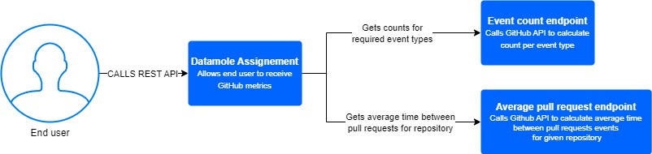

# Datamole Assignement
## Description
The aim of this assignment is to monitor activities happening on GitHub. For that we want you to stream specific events from the Github API (https://api.github.com/events). The events we are interested in are the WatchEvent, PullRequestEvent and IssuesEvent. Based on the collected events, metrics shall be provided at any time via a REST API to the end user. The following metrics should be implemented:  - Calculate the average time between pull requests for a given repository.  - Return the total number of events grouped by the event type for a given    offset. The offset determines how much time we want to look back i.e., an offset of 10 means we count only the events which have been created in the last 10 minutes. Bonus assignment  - Add another REST API endpoint providing a meaningful visualization of one of existing metrics or a newly introduced metric. Please add a README file to your solution that contains how to run the solution and a brief description about your assumptions. To get an idea of your documentation skills, we ask you to create a simple diagram of your application preferably regarding the C4 (level 1) model rules (https://c4model.com/). The assignment will have to be made in Python. We expect it will take 8 hours to do it properly.

## Events
Events interested in:
* WatchEvent
* PullRequestEvent
* IssuesEvent

## Metrics
Metrics to be implemented:
* Calculate the average time between pull requests for a given repository.
* Return the total number of events grouped by the event type for a given    offset. The offset determines how much time we want to look back i.e., an offset of 10 means we count only the events which have been created in the last 10 minutes. 
### Bonus
* Add another REST API endpoint providing a meaningful visualization of one of existing metrics or a newly introduced metric.

## Solution
To provide metrics to end users via a REST API I will need a API framework. Since this project is small I chose **FastAPI**. I haven't work with it yet, but I expect it to be lightweight and easy to use. Other options were Flask and Django. FastAPI will be used together with **uvicorn** as suggested by https://fastapi.tiangolo.com/#installation. For calling GitHub API I will use library **requests** and for manipulating with data library **numpy**.

All dependencies were saved to *requirements.txt* file.

### How to run it
Create virtual environment and activate it
```
$ python -m venv .venv
$ source .venv/Scripts/activate
```
install dependencies
```
$ pip install -r requirements.txt
```
run the ASGI web server
```
$ uvicorn main:app --reload
```
OPTIONAL: ```main.py``` is looking for environment variable **API_TOKEN**, but it can run without it.
### Average time between pull requests
To get average time between pull requests go to website http://127.0.0.1:8000/avg_pull_request/{owner}/{repo_name} where *owner* and *repo_name* serve as placeholders for your values.

Function ```get_avg_time_between_repo_events``` is expecting *owner*, *repo_name*, *headers* and *event_type*. Events are gathered here and then they are send to be processed. Function can be reused for other event types as well, so if we would like to have average time between IssueEvents we simply create the endpoint and pass different event type to the function.

Calculating part was moved to function ```calculate_mean_between_events```. It expects *events* and *event type* to calculate the average time for. Moving calculating to different function was chosen for better readability and reusage of the code for other potential endpoints.

PullRequestEvent has two different actions (opened, closed). Since it would probably be more useful to get average time between just one of these actions its necessary to exclude the other one. Otherwise the result could be misleading. That's why third function ```calculate_mean_between_events_action``` is included but not used. Function provides same functionality with addition filtering on field *action*.
There are many similarities with the previous calculate function, so they could also be combined or call each other for not repeating.

### Total number of events
To get total number of events go to website http://127.0.0.1:8000/events_count/{off_set} where off_set serves as a placeholder for your value in minutes.

Function ```get_events_count``` is expecting *off_set*, *headers* and required *event types* for which we want to know the count. Calculating part was moved to function ```calculate_count_per_event_type```. All events are gathered first and then they are processed. This means we use more storage, but in return we receive more reusable code for the future and also better readability. Other option would be to count the events after each call.

Adding off set time key to response could be an option for a better overview from which timeframe we are receiving events. It would also be possible to receive the list of event types directly from the user as an optional query parameter.

### C4 Model (level 1)
